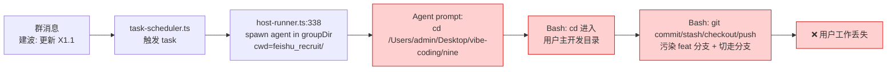
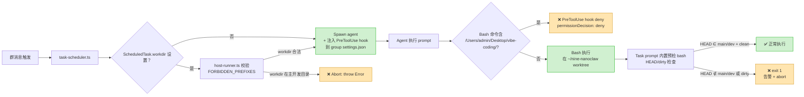

# Spec: Task Workdir 安全护栏 — 防止定时任务撞用户本地 git 工作目录

> dota 全管线，2026-05-24

## 一、事故背景

2026-05-22 22:30 用户在 `~/Desktop/vibe-coding/nine` 的 `feat/dota-codex-effort-tiering` 分支跑 dota（2 commit + 工作树未 commit 改动）。Nanoclaw 招聘机器人「阿飞」响应群消息更新 `tasks.yaml`，在用户**正在用的 feat 分支上**执行了：

```
git add tasks.yaml
git commit -m "chore(recruit): X1.1 增补希云对齐结果"   ← 污染 feat 分支
git stash                                              ← 吃掉用户未 commit 工作
git checkout dev && git pull
git cherry-pick <commit> && git push                  ← 推到 dev
```

用户回到机器时分支已被切走、未 commit 工作丢进 stash，**差点丢工作**（靠 reflog + stash 救回）。

## 二、根因

| 层 | 现状 | 漏洞 |
|---|---|---|
| **Spawn agent** | `src/host-runner.ts:338` `cwd: groupDir`（feishu_recruit/）✓ | 隔离的（无问题）|
| **Task prompt** | `data/ipc/feishu_recruit/current_tasks.json` 里 `recruit-daily-report` 的 prompt 字面写 `cd /Users/admin/Desktop/vibe-coding/nine` | ⚠️ Agent session 收到 prompt 后 cd 走，直奔用户主开发目录 |
| **拦截机制** | 无 | ⚠️ 任何 Bash 命令 cd 到用户主开发目录无人拦 |

**唯一硬防线是「PreToolUse hook 拦 Bash 含用户主开发目录路径」**。Schema 字段 + host-runner 校验是补充。

## 三、Scope

### 在本 PR

| # | 改动 | 性质 |
|---|---|---|
| **P0-1** | 用户在 nine 项目执行 `git worktree add ~/nine-nanoclaw dev`（一次性环境命令）| 环境准备（PR description 指引，不写代码）|
| **P0-2** | 改 `data/ipc/feishu_recruit/current_tasks.json` `recruit-daily-report` task prompt：路径 `/Users/admin/Desktop/vibe-coding/nine` → `~/nine-nanoclaw` | 配置 |
| **P0-3** | 同上 prompt 顶部追加 5 行预检 bash（HEAD/dirty 检查）| 配置 |
| **P1-4** | `src/types.ts:82` `ScheduledTask` 加 `workdir?: string` | 类型 |
| **P1-5** | `src/db.ts` 新增 migration: `ALTER TABLE scheduled_tasks ADD COLUMN workdir TEXT` | DB |
| **P1-6** | `src/host-runner.ts` 新增 FORBIDDEN_PREFIXES 校验：若 task.workdir 在 `/Users/admin/Desktop/vibe-coding/` 直接抛错 abort | 框架硬防 |
| **P1-6b** | `src/types.ts:ContainerInput` 加 `workdir?` + `src/task-scheduler.ts` 透传 task.workdir → runHostAgent → assertSafeWorkdir 完整链路（Codex M1）| 框架硬防 |
| **P1-6c** | `src/task-scheduler.ts` spawn 前调 `assertSafeScript(task.script)` 拦截 task.script 含禁词路径（Codex C2，绕 hook 防御）| 框架硬防 |
| **P1-7** | 新建 `container/hooks/nanoclaw-host-guard.sh`（PreToolUse hook 脚本），复用 `branch-guard.sh` 的 schema 写法 | 框架硬防 |
| **P1-8** | `src/host-runner.ts:109 ensureGroupClaudeSettings` **修对位置**写到 `GROUPS_DIR/<group>/.claude/settings.json`（SDK 真读处，Codex C1）+ 注入 PreToolUse hook 配置 | 框架硬防（关键 bug fix） |

### 不在本 PR

| # | 内容 | 原因 |
|---|---|---|
| P2 | `managed_worktree` 原语自动建/管 worktree | 后续 PR，本次先把硬防御做好 |
| 真因层 | 调查阿飞为何会响应群消息直接 commit + push | 行为逻辑层独立 issue（本 PR 防御层够防再发） |

## 四、数据流图

### 4.1 修复前（事故链）



### 4.2 修复后（多层护栏）



### 4.3 三层护栏对比

| 层 | 位置 | 类型 | 防什么 |
|---|---|---|---|
| **L1 prompt 预检** | task.prompt 顶部 5 行 bash | 软约束（每个 task 各自写）| 配置正确但临时撞车（HEAD 漂移 / dirty）|
| **L2 Schema + host-runner** | `types.ts` + `host-runner.ts` | 硬防（配置时挡）| 新 task 配置 workdir 时填错路径，spawn 前直接 abort |
| **L3 PreToolUse hook** | group settings.json + nanoclaw-host-guard.sh | 硬防（运行时挡）| 老 task / 任何 prompt 内偷偷 cd 主开发目录的 Bash 命令 |

**L3 是必杀** — 老 prompt 不带 workdir 字段也能挡。L1/L2 是配套软规范。

## 五、详细改动

### 5.1 `src/types.ts:82` ScheduledTask 加 workdir

```ts
export interface ScheduledTask {
  // ... existing fields ...
  output_format?: 'plain' | 'card' | null;
  workdir?: string;  // 新增：任务实际工作目录。FORBIDDEN_PREFIXES 检查在此基础上做。
}
```

### 5.2 `src/db.ts` DB migration

参照现有模式（L106-127 用 try/catch，**不是 columnExists helper**）：

```ts
// Add workdir column if it doesn't exist (migration for existing DBs)
try {
  database.exec(`ALTER TABLE scheduled_tasks ADD COLUMN workdir TEXT`);
} catch {
  /* column already exists */
}
```

### 5.3 `src/host-runner.ts` FORBIDDEN_PREFIXES 校验

新增常量 + spawn 前校验。**路径用 `$HOME` 运行时展开**（不 hardcode 个人路径，团队成员/CI 同样生效）：

```ts
import os from 'os';
import path from 'path';

// 团队成员部署后 $HOME 不同，运行时构造黑名单（FORBIDDEN_WORKDIR_PATTERNS 描述「any user's main dev directory」）
function buildForbiddenWorkdirPrefixes(): string[] {
  const home = os.homedir();
  return [
    path.join(home, 'Desktop/vibe-coding') + path.sep,  // 任何用户的主开发目录
    '/workspace/extra/vibe-coding/',                      // 容器内挂载（部分老 task 用此路径）
  ];
}

// 规范化路径：展开 ~、$HOME、解决相对路径，统一比较基线
function normalizeWorkdir(workdir: string): string {
  const home = os.homedir();
  // 展开 leading ~
  let expanded = workdir.replace(/^~(?=$|\/)/, home);
  // 展开 $HOME literal
  expanded = expanded.replace(/^\$HOME(?=$|\/)/, home);
  // 解 path.resolve（去 ./../、规范化）
  return path.resolve(expanded);
}

// runHostAgent() spawn 前（在 ensureGroupClaudeSettings 之后）调
function assertSafeWorkdir(workdir: string | undefined): void {
  if (!workdir) return;  // 老 task 无 workdir 字段 — 本层不挡，L3 PreToolUse hook 兜底
  const normalized = normalizeWorkdir(workdir);
  for (const prefix of buildForbiddenWorkdirPrefixes()) {
    if (normalized.startsWith(prefix)) {
      throw new Error(
        `❌ Task workdir 在用户主开发目录 (${normalized}) — 禁止。\n` +
        `可能撞 in-progress 工作（2026-05-22 事故）。\n\n` +
        `改用 nanoclaw 专属 worktree，例如：\n` +
        `  cd <repo-root> && git worktree add ~/nanoclaw-worktrees/<name> <branch>\n` +
        `然后把任务 workdir 设为 ~/nanoclaw-worktrees/<name>\n\n` +
        `详见 spec: docs/specs/2026-05-24-task-workdir-safety-guard.md`
      );
    }
  }
}
```

### 5.4 `container/hooks/nanoclaw-host-guard.sh` 新建 PreToolUse hook

复用 `~/.claude/hooks/branch-guard.sh` 的 schema（实证可用），但**精准匹配命令式语法**避免误拦 `cat spec.md` / `echo "字面"` 等合法操作：

```bash
#!/bin/bash
# Nanoclaw host guard: deny Bash that operates on user's main dev directories.
# Matches command-form patterns (cd / git -C / --git-dir=), not bare substring,
# to avoid false-positive on reading spec docs / echo with literal paths.
set -uo pipefail

# 依赖检查（Codex m1：jq 缺失时退化为 fail-closed）
command -v jq >/dev/null 2>&1 || {
  printf '{"hookSpecificOutput":{"hookEventName":"PreToolUse","permissionDecision":"deny","permissionDecisionReason":"❌ nanoclaw-host-guard 依赖 jq 但未找到 — fail-closed。请在 PATH 装 jq。"}}\n'
  exit 0
}

INPUT=$(cat)
TOOL=$(printf '%s' "$INPUT" | jq -r '.tool_name // ""')

# Fail-closed 必须在 "!= Bash" 早退之前（critic R3 M3：否则 TOOL="" 时直接走 exit 0 漏过 deny）
# 区分「TOOL 为空（解析失败/损坏）」vs「TOOL 是其它合法工具」
if [[ -z "$TOOL" ]]; then
  # 输入损坏 → fail-closed → deny
  jq -n '{
    hookSpecificOutput: {
      hookEventName: "PreToolUse",
      permissionDecision: "deny",
      permissionDecisionReason: "Hook 输入 JSON 解析失败或缺 tool_name 字段 — fail-closed 保护拦截。"
    }
  }'
  exit 0
fi

# 只拦 Bash（Edit/Write 在 group sandbox 已隔离）
[[ "$TOOL" != "Bash" ]] && exit 0

CMD=$(printf '%s' "$INPUT" | jq -r '.tool_input.command // ""')

# 黑名单路径正则片段（运行时构造，含 $HOME 展开）
HOME_DESKTOP=$(printf '%s' "$HOME/Desktop/vibe-coding")
# Bash regex 元字符转义
ESC_HOME_DESKTOP=$(printf '%s' "$HOME_DESKTOP" | sed 's/[\/&\.]/\\&/g')
ESC_WORKSPACE='\/workspace\/extra\/vibe-coding'

# 命令式语法：cd / pushd / git -C / --git-dir= / --work-tree= / GIT_DIR=
# 后跟禁词路径前缀 — 用 grep -E 正则匹配
# 引号字符类：双引号 + 单引号都覆盖（critic R3 M1: 单引号路径不能绕过）
# 命令式语法覆盖：cd / pushd / git -C / --git-dir= / --work-tree= / GIT_DIR= / GIT_WORK_TREE=
# 路径形式覆盖：$HOME 展开后绝对路径 / 容器路径 / tilde 字面 / $HOME / ${HOME} 字面（Codex M3）
FORBIDDEN_REGEXES=(
  # $HOME 展开后路径 + 容器路径
  "\\b(cd|pushd)[[:space:]]+[\\\"']?(${ESC_HOME_DESKTOP}|${ESC_WORKSPACE})\\b"
  "\\bgit[[:space:]]+(-C[[:space:]]+|--git-dir=|--work-tree=)[\\\"']?(${ESC_HOME_DESKTOP}|${ESC_WORKSPACE})\\b"
  "\\bGIT_DIR=[\\\"']?(${ESC_HOME_DESKTOP}|${ESC_WORKSPACE})\\b"
  "\\bGIT_WORK_TREE=[\\\"']?(${ESC_HOME_DESKTOP}|${ESC_WORKSPACE})\\b"
  # Tilde 字面（Bash 命令字符串里 ~ 不展开就漏过 $HOME 检查）
  "\\b(cd|pushd)[[:space:]]+[\\\"']?~/Desktop/vibe-coding\\b"
  "\\bgit[[:space:]]+(-C[[:space:]]+|--git-dir=|--work-tree=)[\\\"']?~/Desktop/vibe-coding\\b"
  # \$HOME / \${HOME} 字面 — bash 命令字符串里 \$HOME 不会立即展开（写成 \"\\\$HOME\" 形式），用户能写出绕过 regex
  "\\b(cd|pushd)[[:space:]]+[\\\"']?\\\$\\{?HOME\\}?/Desktop/vibe-coding\\b"
  "\\bgit[[:space:]]+(-C[[:space:]]+|--git-dir=|--work-tree=)[\\\"']?\\\$\\{?HOME\\}?/Desktop/vibe-coding\\b"
  # 部分覆盖间接调用（find/xargs/sh -c），后跟禁词路径 — known limitation 不彻底
  "\\b(find|xargs)\\b.*[\\\"']?(${ESC_HOME_DESKTOP}|${ESC_WORKSPACE})\\b"
)

deny() {
  jq -n --arg r "$1" '{
    hookSpecificOutput: {
      hookEventName: "PreToolUse",
      permissionDecision: "deny",
      permissionDecisionReason: $r
    }
  }'
  exit 0
}

# Fail-closed 已上移到 !=Bash 早退之前（见脚本顶部，critic R3 M3 修复）

for re in "${FORBIDDEN_REGEXES[@]}"; do
  if printf '%s' "$CMD" | grep -qE "$re"; then
    deny "❌ Nanoclaw 安全护栏：禁止访问用户主开发目录或容器内 /workspace/extra/vibe-coding/。
该目录可能正被用户用于 in-progress 工作（2026-05-22 事故）。

改用 nanoclaw 专属 worktree：
  cd <repo-root> && git worktree add ~/nanoclaw-worktrees/<name> <branch>
然后任务里 cd ~/nanoclaw-worktrees/<name>

详见 spec: docs/specs/2026-05-24-task-workdir-safety-guard.md

命中命令:
  $CMD"
  fi
done

exit 0
```

**精准匹配设计**：
- `cat docs/specs/...task-workdir-safety-guard.md`（含字面 `/Users/admin/Desktop/vibe-coding/`）→ ✅ 通过（不是 cd/git -C 形式）
- `echo "禁止 /Users/admin/Desktop/vibe-coding/"` → ✅ 通过
- `cd /Users/admin/Desktop/vibe-coding/nine` → ❌ deny（命中 `(cd|pushd) <prefix>`）
- `cd '/Users/admin/Desktop/vibe-coding/nine'` 单引号包裹 → ❌ deny（critic R3 M1 修：引号字符类 `[\"']?`）
- `git -C /Users/admin/Desktop/vibe-coding/nine status` → ❌ deny
- `git --git-dir=/Users/admin/Desktop/vibe-coding/nine/.git log` → ❌ deny（--git-dir= 形式）
- `GIT_DIR=/Users/admin/Desktop/vibe-coding/nine/.git git log` → ❌ deny（env var 形式）
- `cd ~/Desktop/vibe-coding/nine`（字面 ~）→ ❌ deny（专项 regex 覆盖）
- `cd /workspace/extra/vibe-coding/nine` → ❌ deny（容器路径同挡）
- `bash -c "cd /Users/admin/Desktop/vibe-coding/nine"` → ❌ deny（grep 字面匹配整条命令，含 -c 参数内字符串）
- `eval 'cd /Users/admin/Desktop/vibe-coding/nine'` → ❌ deny（同理）

**over-block 故意行为**（critic Round 2 C2.1）：
- `cd /workspace/extra/vibe-coding-other/` 也被拦（任何 vibe-coding 后缀子目录）— 故意，避免未来新增同型路径漏挡
- 若需要细化白名单子目录，由 P2 配置化方案处理

**fail-closed 拍板**（critic Round 2 M3）：jq 解析失败时，hook **fail-closed → deny**（保守安全）。理由：(a) Claude Code 框架正常输入 JSON 一定合法；(b) 异常 input 视为恶意/损坏，宁错杀不放过；(c) 真撞 fail-closed 时 log 可见，方便排查。

**Known limitations**（critic Round 2 M1+m1 / Codex M4）：
- `$HOME` 含特殊 regex 元字符（`.`、`*` 等）目前只 sed 转义 `/&.` — macOS/Linux 用户主目录路径不应含其它元字符，超出范围视为 known limitation
- `normalizeWorkdir` 已展开 `~/` / `$HOME` / `${HOME}` 三种形式（Codex Phase 6 M4 修）；`$USER` 等其它 env var 不展开 — 任务 prompt 写 workdir 时**应**用 `~/` 或绝对路径形式
- **hook 字面匹配局限**（Codex M4 / Codex Phase 6 M3）：hook 是字面字符串模式匹配（非语义沙箱），无法防御：
  - `find <path> -exec sh -c 'cd "$1"; ...' _ {} \;`（位置参数）
  - `base=/Users/.../vibe-coding/nine; cd "$base"`（shell 变量构造）
  - `cd "$(printf /Users/.../vibe-coding/nine)"`（命令替换）
  - `cd /Users/X/Desktop/./vibe-coding/`（路径规范化绕过）
  - 符号链接 / `python -c "os.chdir(...)"` / 其它语言 syscall

  本 PR 仅覆盖**直白命令式**（cd / pushd / git -C / GIT_DIR= / find / xargs 直接含路径）的常见 90% case。彻底防御需 sandboxing（chroot / unshare / seccomp），超出 PR 范围。
  - L2 `assertSafeWorkdir` + L2.5 `assertSafeScript` 在 **task 配置层**兜底（创建 task 时填的 workdir / script 字段是 declarative，绕过路径有限）
  - L3 hook 是**运行时兜底**，主要保护老 task 直白 cd 形式
  - 三层组合对**意外撞车**（业务 task 误填路径 / 复制粘贴失误）已闭环；对**恶意构造**仅作 best-effort

### 5.5 `src/host-runner.ts:ensureGroupClaudeSettings` 注入 hook

**⚠️ 关键修正（Codex C1）**：现有函数写到 `DATA_DIR/sessions/<group>/.claude/settings.json`，但 Claude SDK 实际读 `cwd=GROUPS_DIR/<group>` + `settingSources=['project','user']` → project settings 真位置是 **`GROUPS_DIR/<group>/.claude/settings.json`**。

**实证**（grep nanoclaw 0 caller 读 `data/sessions/<group>/.claude/`）：原 ensureGroupClaudeSettings 写的 env 字段**从未生效**（dead code 多日）。本 PR 顺手修对位置，将注入路径从 `DATA_DIR/sessions/<group>/.claude/` 改到 `GROUPS_DIR/<group>/.claude/`。

修改现有函数行为分两种 case：

**case A：文件不存在** → 写完整 default settings（含 hooks）到正确位置
**case B：文件已存在** → 读 → 检查是否含 `nanoclaw-host-guard.sh` → 没有则在 PreToolUse 数组**末尾追加**（**显式数组拼接，不浅合并** [[debugging_jq_shallow_merge_overwrites]]）→ 写回。**幂等**（已含则跳过）。

**对已部署 group 的影响**：
- 现有 `data/sessions/<group>/.claude/settings.json` 留在原位（不删，避免破坏未知依赖；后续 follow-up 清理）
- 升级 nanoclaw 后第一次 spawn agent → 走 case A（`groups/<group>/.claude/settings.json` 还不存在）→ 写完整 default 含 hooks
- 之后每次 spawn → case B → 幂等检查跳过
- 已运行中的 host agent session 不受影响（settings 不热加载）；下次 spawn 才读到新 settings
- Phase 7 集成验证：手工触发一次 task → 确认 **正确位置** `groups/<group>/.claude/settings.json` 生成 + hook 真拦截

```ts
// 顶部 imports 加：
import path from 'path';
import { resolveGroupFolderPath } from './group-folder.js';  // 统一用 helper（不直接 import GROUPS_DIR，Codex R6 m1）

// hook 脚本绝对路径（部署后稳定 — 用 __dirname 避免 process.cwd() 不稳定）
const HOOK_SCRIPT_PATH = path.resolve(__dirname, '..', 'container', 'hooks', 'nanoclaw-host-guard.sh');

const NANOCLAW_GUARD_HOOK = {
  matcher: 'Bash',
  hooks: [{ type: 'command' as const, command: `bash ${HOOK_SCRIPT_PATH}`, timeout: 5 }],
};

function hasNanoclawGuard(preToolUse: any[]): boolean {
  return preToolUse.some((entry: any) =>
    Array.isArray(entry.hooks) &&
    entry.hooks.some((h: any) => typeof h.command === 'string' && h.command.includes('nanoclaw-host-guard.sh'))
  );
}

function ensureGroupClaudeSettings(group: RegisteredGroup): void {
  // ⚠️ 关键修正：写入位置改到 GROUPS_DIR（SDK 实际读位置），不是 DATA_DIR/sessions
  const groupClaudeDir = path.join(resolveGroupFolderPath(group.folder), '.claude');
  fs.mkdirSync(groupClaudeDir, { recursive: true });
  const settingsFile = path.join(groupClaudeDir, 'settings.json');

  const defaultEnv = {
    CLAUDE_CODE_EXPERIMENTAL_AGENT_TEAMS: '1',
    CLAUDE_CODE_ADDITIONAL_DIRECTORIES_CLAUDE_MD: '1',
    CLAUDE_CODE_DISABLE_AUTO_MEMORY: '0',
  };

  if (!fs.existsSync(settingsFile)) {
    // Case A: 全新 — 写完整 default（含 hooks）
    fs.writeFileSync(
      settingsFile,
      JSON.stringify({ env: defaultEnv, hooks: { PreToolUse: [NANOCLAW_GUARD_HOOK] } }, null, 2) + '\n'
    );
    return;
  }

  // Case B: 已存在 — 显式数组拼接，幂等
  let existing: any;
  try {
    existing = JSON.parse(fs.readFileSync(settingsFile, 'utf-8'));
  } catch {
    // 解析失败 — 视为损坏，写覆盖（保护性 fallback）
    existing = { env: defaultEnv };
  }
  // Defensive: existing.hooks 可能是非 object（损坏数据 / 用户手改错）— 修复成 {} 避免 TypeError
  if (existing.hooks == null || typeof existing.hooks !== 'object' || Array.isArray(existing.hooks)) {
    existing.hooks = {};
  }
  const existingPreToolUseRaw = existing.hooks.PreToolUse;
  const existingPreToolUse: any[] = Array.isArray(existingPreToolUseRaw) ? existingPreToolUseRaw : [];
  if (!hasNanoclawGuard(existingPreToolUse)) {
    existing.hooks.PreToolUse = [...existingPreToolUse, NANOCLAW_GUARD_HOOK];
    fs.writeFileSync(settingsFile, JSON.stringify(existing, null, 2) + '\n');
  }
  // 已含 — 幂等跳过
}
```

### 5.5b ContainerInput / task-scheduler.ts 传 workdir 完整链路（Codex M1）

**spec §5.3 加了 `assertSafeWorkdir()` 但漏了 task-scheduler 传递 workdir** — 补完整链路：

```ts
// src/host-runner.ts 顶部 ContainerInput interface（L28）
export interface ContainerInput {
  prompt: string;
  // ... existing fields ...
  isScheduledTask?: boolean;
  script?: string;
  workdir?: string;  // 新增：从 ScheduledTask.workdir 传入
}

// src/task-scheduler.ts L177-188 构造 ContainerInput 加 workdir 透传
const output = await runHostAgent(
  group,
  {
    prompt: task.prompt,
    sessionId,
    groupFolder: task.group_folder,
    chatJid: task.chat_jid,
    isMain,
    isScheduledTask: true,
    assistantName: ASSISTANT_NAME,
    script: task.script || undefined,
    workdir: task.workdir || undefined,  // ← 新增
  },
  // ...
);

// src/host-runner.ts runHostAgent() 内 spawn 前调（L311 前后）
assertSafeWorkdir(input.workdir);  // 老 task 无 workdir 字段 → no-op；L3 hook 兜底
```

### 5.5c task.script 路径校验（Codex C2 — 新增防御层）

**Codex 揪出**：`task.script` 在 `container/agent-runner/src/index.ts:843-846` 通过 `runScript()` 用 `execFile('bash', [scriptPath])` 直跑，**完全绕过 Claude PreToolUse hook**。任何 ScheduledTask 配 script 字段，prompt 层的 L3 hook 失效。

**新增防御 L2.5**：`task-scheduler.ts` 触发 spawn **前**，对 `task.script` 内容做同样的 FORBIDDEN_REGEXES 检查（复用 hook 的 regex 集，TypeScript 端实现），命中则**直接 abort task**（写入 task_run_logs status=error + error=拦截原因），不 spawn。

```ts
// src/task-scheduler.ts 新增（在 runHostAgent 调用前）：

// 复用 §5.4 hook 的 regex 集（统一来源避免漂移；TS 端和 hook bash 端逐条对齐）
function buildForbiddenCommandRegexes(): RegExp[] {
  const home = os.homedir();
  const homeDesktop = path.join(home, 'Desktop', 'vibe-coding');
  const escapedHomeDesktop = homeDesktop.replace(/[.*+?^${}()|[\]\\]/g, '\\$&');
  const escapedWorkspace = '\\/workspace\\/extra\\/vibe-coding';
  return [
    // $HOME 展开后绝对路径 + 容器路径
    new RegExp(`\\b(cd|pushd)\\s+["']?(${escapedHomeDesktop}|${escapedWorkspace})\\b`),
    new RegExp(`\\bgit\\s+(-C\\s+|--git-dir=|--work-tree=)["']?(${escapedHomeDesktop}|${escapedWorkspace})\\b`),
    new RegExp(`\\bGIT_DIR=["']?(${escapedHomeDesktop}|${escapedWorkspace})\\b`),
    new RegExp(`\\bGIT_WORK_TREE=["']?(${escapedHomeDesktop}|${escapedWorkspace})\\b`),
    // Tilde 字面
    new RegExp(`\\b(cd|pushd)\\s+["']?~/Desktop/vibe-coding\\b`),
    new RegExp(`\\bgit\\s+(-C\\s+|--git-dir=|--work-tree=)["']?~/Desktop/vibe-coding\\b`),
    // $HOME / ${HOME} 字面
    new RegExp(`\\b(cd|pushd)\\s+["']?\\$\\{?HOME\\}?/Desktop/vibe-coding\\b`),
    new RegExp(`\\bgit\\s+(-C\\s+|--git-dir=|--work-tree=)["']?\\$\\{?HOME\\}?/Desktop/vibe-coding\\b`),
    // find/xargs 间接调用（Codex R6 M1：原 spec 漏，与 hook §5.4 对齐）
    new RegExp(`\\b(find|xargs)\\b.*["']?(${escapedHomeDesktop}|${escapedWorkspace})\\b`),
  ];
}

function assertSafeScript(script: string | null | undefined): void {
  if (!script) return;
  const regexes = buildForbiddenCommandRegexes();
  for (const re of regexes) {
    if (re.test(script)) {
      throw new Error(
        `❌ Task script 含禁止路径（${re.source}）— abort。\n` +
        `script 走 execFile('bash', ...) 绕过 PreToolUse hook，必须 task-scheduler 层挡。\n` +
        `详见 spec §5.5c。\n\n` +
        `命中片段:\n  ${script.match(re)?.[0]}`
      );
    }
  }
}

// 在 runHostAgent 调用前：
assertSafeWorkdir(task.workdir);
assertSafeScript(task.script);
```

**为什么不直接复用 hook bash 脚本**：脚本通过 stdin 接 JSON 走 deny 输出协议（PreToolUse 专用），task-scheduler 是 TypeScript 直跑 regex 更轻量；regex 集统一定义在 `src/forbidden-patterns.ts` 共享文件，hook bash 那边通过 ENV 变量或独立常量同步（**单一来源**：放 `forbidden-patterns.ts` + hook 脚本顶部 inline 注释引用，跑测试断言两边 regex 字面对齐）。

### 5.6 `data/ipc/feishu_recruit/current_tasks.json` prompt 改造

**关键区分**（critic Round 2 C2.2 揪出，避免破坏容器任务）：

| Task ID | 调度类型 | 路径形式 | 跑在哪 | 本 PR 改不改 |
|---|---|---|---|---|
| `recruit-daily-report` | cron `0 7 * * 1-5` | host 路径 `/Users/admin/Desktop/vibe-coding/nine` | host-runner（host 进程）| ✅ **改**为 `~/nine-nanoclaw` |
| `task-1779372844084-4swq7r` | cron `0 23 * * *` | 容器路径 `/workspace/extra/vibe-coding/nine/...` | 容器内 agent runner | ❌ **不改**（容器内 mount 是该路径，host 上不存在）|

**为什么 23:00 task 不改**：
- 容器路径 `/workspace/extra/vibe-coding/` 在 host 上**不存在**，host-runner 模式不可能访问，自然 ENOENT
- 若该 task 切到 host-runner 模式跑，**L3 PreToolUse hook 会自然拦下**（FORBIDDEN_REGEXES 已含 `/workspace/extra/vibe-coding`）
- 改容器路径 = 破坏容器内 mount 对齐，得不偿失

仅改 `recruit-daily-report` 一个 task。

**M2 verify 结论**（critic R3）：prompt 末尾「nine 仓库当前分支可能是 `feat/testcase-gen-skill-design`（脚本依赖此分支）」是 historical artifact —— `grep -E "testcase-gen-skill-design|feat/.*skill" scripts/daily_routine.py` 实证 0 命中，dev 分支 daily_routine.py 完整可跑。本 PR 顺手清理 prompt 那段误导文字。

改造四处（前 3 个是路径 + 预检；第 4 个清 historical artifact）：

1. `cd /Users/admin/Desktop/vibe-coding/nine` → `cd ~/nine-nanoclaw`
2. 文件路径示例 `/Users/admin/Desktop/vibe-coding/nine/docs/project-mgmt/recruit/daily-reports/YYYY-MM-DD.md` → `~/nine-nanoclaw/docs/project-mgmt/recruit/daily-reports/YYYY-MM-DD.md`
3. prompt 顶部追加：
   ```bash
   # === 安全闸：HEAD + 工作区状态预检 ===
   WORKDIR=~/nine-nanoclaw
   BRANCH=$(git -C "$WORKDIR" rev-parse --abbrev-ref HEAD 2>/dev/null || echo "?")
   if [ "$BRANCH" != "dev" ] && [ "$BRANCH" != "main" ]; then
     echo "❌ ABORT: $WORKDIR HEAD=$BRANCH，期望 dev/main"; exit 1
   fi
   if [ -n "$(git -C "$WORKDIR" status --porcelain | head -1)" ]; then
     echo "❌ ABORT: $WORKDIR 工作树有未 commit 改动"; exit 1
   fi
   echo "✅ 安全闸通过：$WORKDIR on $BRANCH"
   ```

## 六、影响 & 回归风险

| 风险 | 评估 | 缓解 |
|---|---|---|
| **PreToolUse hook schema 写错导致全失效** [[project_dota_hook_schema_v3_pr1874]] | 中 | 复用 `branch-guard.sh` 已实证 schema；Phase 4 TDD 测试 hook 真拦截（不依赖 review 看代码）|
| **hook merge 覆盖用户已有 PreToolUse** [[debugging_jq_shallow_merge_overwrites]] | 中 | 实现用显式数组拼接（5.5 代码示例）+ TDD 测试 existing.hooks 被保留 |
| 老 task 不带 workdir 字段 | **L2 完全失效 — 设计性盲区**（critic R1 M2）| `assertSafeWorkdir(undefined)` 直接 return → 老 task 全部放行 L2；**全靠 L3 PreToolUse hook 兜底**。spec 明确记录此盲区，新增 task 时**应**写 workdir 字段（但不强制，老 task 改造可渐进）|
| FORBIDDEN_PREFIXES 路径硬编码 | **关键改造**（critic R1 M4）| 不 hardcode 个人路径 → 运行时构造 `path.join(os.homedir(), 'Desktop/vibe-coding')` + `/workspace/extra/vibe-coding/`，团队成员/CI 不同 $HOME 都生效；hook bash 同样用 `$HOME` 运行时展开 |
| **worktree on dev 与用户级 branch-guard 冲突**（Codex M2）| **verify 结果：不冲突** | `scripts/daily_routine.py:641-643` 实证：commit/push 通过 Python `subprocess.run([git_cli, ...])` 直跑，不经过 Claude Bash 工具，branch-guard 拦不到（branch-guard 是 Claude PreToolUse hook，只拦 Claude tool calls）。worktree on dev 跑 daily_routine 全程绕过 branch-guard。**但**：nanoclaw 自动 `push origin dev` 行为本身值得讨论（独立 follow-up，不在本 PR）|
| **L3 PreToolUse hook 注入位置错误**（Codex C1）| **关键 bug fix** | spec §5.5 已修：从 `data/sessions/<group>/.claude/` 改到 `groups/<group>/.claude/`（SDK 真读位置）。**破窗发现**：原 ensureGroupClaudeSettings 写的位置 0 caller 读，env 字段从未生效 |
| **`task.script` 绕过 hook**（Codex C2）| **新增防御层** | spec §5.5c L2.5 — task-scheduler 在 spawn 前调 `assertSafeScript(task.script)` 拦截 |
| Hook 误拦合法操作（如 task 真的要读用户目录） | 低 | 阿飞业务上**不应该**访问用户主开发目录（应该用 nanoclaw worktree），现有 task 仅 1 个命中改掉即可 |
| 改 host-runner.ts 引入框架层 bug | 低 | 6 个新增/改动函数都有 unit test 覆盖（vitest） |

## 七、测试计划（Phase 4 TDD）

### 7.1 Unit tests（vitest）

| 测试 | 文件 | 断言 |
|---|---|---|
| `assertSafeWorkdir` 拦 `/Users/admin/Desktop/vibe-coding/...` | `host-runner.test.ts` 追加 | 抛错含 "用户主开发目录" |
| `assertSafeWorkdir` 拦 `~/Desktop/vibe-coding/...`（tilde）| 同上 | 抛错（tilde 展开）|
| `assertSafeWorkdir` 允许 `~/nine-nanoclaw/` | 同上 | 不抛错 |
| `assertSafeWorkdir` 允许 undefined（无 workdir 字段，向后兼容）| 同上 | 不抛错 |
| **`assertSafeScript` 拦 script 含 `cd /Users/.../Desktop/vibe-coding/...`**（Codex C2）| `task-scheduler.test.ts` 新增 | 抛错含 "script 含禁止路径" |
| **`assertSafeScript` 允许 undefined / null / 空 script** | 同上 | 不抛错 |
| **`assertSafeScript` 允许 `cd ~/nine-nanoclaw/`** | 同上 | 不抛错 |
| **task-scheduler 透传 task.workdir → runHostAgent.input.workdir**（Codex M1）| `task-scheduler.test.ts` 新增 | mock runHostAgent，断言 input.workdir 与 task.workdir 一致 |
| `ensureGroupClaudeSettings` 新建 settings 含 PreToolUse hook | 同上 | settings.json 含 `nanoclaw-host-guard.sh` 路径 |
| `ensureGroupClaudeSettings` 写到**正确位置** `groups/<group>/.claude/`（Codex C1）| 同上 | `resolveGroupFolderPath(folder) + '/.claude/settings.json'` 存在（统一用 helper，不直接 GROUPS_DIR 拼）|
| `ensureGroupClaudeSettings` merge 已有 PreToolUse 不覆盖 | 同上 | 已有 hooks + nanoclaw-host-guard 都在 |
| `ensureGroupClaudeSettings` 幂等（重复调不重复加）| 同上 | hasNanoclawGuard 检查生效 |
| DB migration `workdir` 列 idempotent | `db.test.ts` 追加 | try/catch 模式重复跑不抛 |

### 7.2 Hook 拦截测试（vitest spawn hook 脚本，挂 npm test）

通过 vitest `spawnSync('bash', ['container/hooks/nanoclaw-host-guard.sh'], { input: JSON.stringify({...}) })` 跑 hook，断言 stdout / exit code。

新文件 `src/nanoclaw-host-guard.test.ts`：

```ts
import { describe, expect, it } from 'vitest';
import { spawnSync } from 'child_process';
import path from 'path';

const HOOK = path.resolve(__dirname, '..', 'container', 'hooks', 'nanoclaw-host-guard.sh');

// 显式传 env（不动 process.env，避免测试间脏污 — critic R2 M2）
function runHook(input: object, opts: { home?: string } = {}): { stdout: string; status: number } {
  const childEnv = { ...process.env, HOME: opts.home ?? process.env.HOME };
  const r = spawnSync('bash', [HOOK], {
    input: JSON.stringify(input),
    encoding: 'utf-8',
    env: childEnv,
  });
  return { stdout: r.stdout, status: r.status ?? 0 };
}

describe('nanoclaw-host-guard hook', () => {
  const TEST_HOME = '/Users/testuser';

  it('denies cd into <HOME>/Desktop/vibe-coding/', () => {
    const { stdout } = runHook(
      { tool_name: 'Bash', tool_input: { command: 'cd /Users/testuser/Desktop/vibe-coding/nine && ls' } },
      { home: TEST_HOME }
    );
    expect(stdout).toContain('"permissionDecision": "deny"');
  });

  it('denies git -C into forbidden dir', () => {
    const { stdout } = runHook(
      { tool_name: 'Bash', tool_input: { command: 'git -C /Users/testuser/Desktop/vibe-coding/nine status' } },
      { home: TEST_HOME }
    );
    expect(stdout).toContain('"permissionDecision": "deny"');
  });

  it('denies cd ~/Desktop/vibe-coding/ literal tilde form', () => {
    const { stdout } = runHook(
      { tool_name: 'Bash', tool_input: { command: 'cd ~/Desktop/vibe-coding/nine' } },
      { home: TEST_HOME }
    );
    expect(stdout).toContain('"permissionDecision": "deny"');
  });

  it('denies /workspace/extra/vibe-coding/ container path', () => {
    const { stdout } = runHook({ tool_name: 'Bash', tool_input: { command: 'cd /workspace/extra/vibe-coding/nine' } });
    expect(stdout).toContain('"permissionDecision": "deny"');
  });

  it('denies --git-dir= form', () => {
    const { stdout } = runHook(
      { tool_name: 'Bash', tool_input: { command: 'git --git-dir=/Users/testuser/Desktop/vibe-coding/nine/.git log' } },
      { home: TEST_HOME }
    );
    expect(stdout).toContain('"permissionDecision": "deny"');
  });

  it('denies GIT_DIR= env var form', () => {
    const { stdout } = runHook(
      { tool_name: 'Bash', tool_input: { command: 'GIT_DIR=/Users/testuser/Desktop/vibe-coding/nine/.git git log' } },
      { home: TEST_HOME }
    );
    expect(stdout).toContain('"permissionDecision": "deny"');
  });

  it('denies single-quoted forbidden path (critic R3 M1)', () => {
    const { stdout } = runHook(
      { tool_name: 'Bash', tool_input: { command: "cd '/Users/testuser/Desktop/vibe-coding/nine'" } },
      { home: TEST_HOME }
    );
    expect(stdout).toContain('"permissionDecision": "deny"');
  });

  it('allows cat of spec doc containing literal forbidden path', () => {
    const { stdout, status } = runHook(
      { tool_name: 'Bash', tool_input: { command: 'cat docs/specs/2026-05-24-task-workdir-safety-guard.md' } },
      { home: TEST_HOME }
    );
    expect(stdout).toBe('');
    expect(status).toBe(0);
  });

  it('allows echo with literal forbidden string', () => {
    const { stdout, status } = runHook(
      { tool_name: 'Bash', tool_input: { command: 'echo "禁止 /Users/admin/Desktop/vibe-coding/"' } },
      { home: TEST_HOME }
    );
    expect(stdout).toBe('');
    expect(status).toBe(0);
  });

  it('allows cd to ~/nanoclaw-worktrees/ legitimate workdir', () => {
    const { stdout, status } = runHook(
      { tool_name: 'Bash', tool_input: { command: 'cd ~/nanoclaw-worktrees/nine && git status' } },
      { home: TEST_HOME }
    );
    expect(stdout).toBe('');
    expect(status).toBe(0);
  });

  it('skips non-Bash tools', () => {
    const { stdout, status } = runHook({ tool_name: 'Edit', tool_input: { file_path: '/Users/admin/Desktop/vibe-coding/nine/foo.ts' } });
    expect(stdout).toBe('');
    expect(status).toBe(0);
  });

  it('fail-closed on empty tool_name (malformed input)', () => {
    const { stdout } = runHook({} as any);
    expect(stdout).toContain('"permissionDecision": "deny"');
    expect(stdout).toContain('fail-closed');
  });
});
```

跑命令：`npm test`（vitest 自动捕捉 `.test.ts`）。CI 同步。

### 7.3 集成实证（Phase 7）

**Pre-deploy 实证**（不用部署，本地验）：
1. 跑 `npm test` 全套测试 PASS（含 8 个 hook 拦截 + assertSafeWorkdir + ensureGroupClaudeSettings 单测）
2. 手工调用 `ensureGroupClaudeSettings({folder: 'test-group'})` 一次，看 **`groups/test-group/.claude/settings.json`**（Codex R6 M2 修：SDK 真读位置，不是旧 `data/sessions/...`）是否含 PreToolUse hook，**幂等**再调一次 hooks 数组不重复
3. 手工 stdin 喂 hook 脚本各场景，断言 stdout 跟 spec §5.4 注释里"精准匹配设计"清单一致

**Post-deploy 实证**（用户拍板部署后才做）：
- 触发一次 `recruit-daily-report`，看 task_run_logs 不报错 + 群里收到日报
- **用 test-only group**（如新建 `test_guard_group` folder，不污染生产 feishu_recruit）创建一次性 task，prompt 注入 `cd /Users/admin/Desktop/vibe-coding/nine` → 看 hook 是否 deny + group session log 是否有 hook deny 痕迹
- 已运行中的 host agent session 不受影响（spec §5.5 已声明 settings 不热加载）— 通过 task_run_logs 看新 spawn 的 session 才读到新 hook

## 八、提交计划

- 分支：`fix/task-workdir-safety-guard`（基于 `origin/main` 最新）
- PR 目标：`main`（nanoclaw 默认主分支）
- worktree：建在 `nanoclaw/.worktrees/` 或 `~/nanoclaw-task-workdir-safety/`
- commit message：`fix(scheduler): 防定时任务撞用户本地 git 目录 — 三层护栏（prompt 预检 + schema 校验 + PreToolUse hook）`

## 九、Follow-up（不在本 PR）

1. **P2 managed_worktree 原语** — `workdir: {type: "managed_worktree", repo: "...", branch: "dev"}`，nanoclaw 自动建/管，根治"任务作者懒得想路径"问题
2. **FORBIDDEN_PREFIXES 配置化** — 环境变量或 config file，而非 hardcode（适配不同 OS / 用户）
3. **行为层根因调查** — 阿飞为何会响应群消息直接 commit + push 到 feat 分支（应该至少先检查 HEAD），独立 issue
