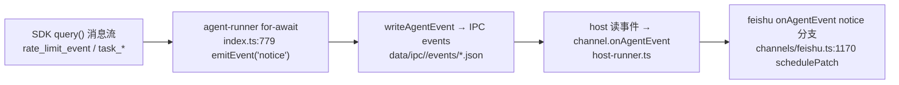
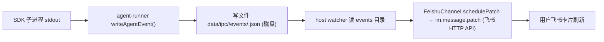

# NanoClaw DOTA 运行时进度可见 Implementation Plan（增量 A）

> **For agentic workers:** REQUIRED SUB-SKILL: Use superpowers:subagent-driven-development (recommended) or superpowers:executing-plans to implement this plan task-by-task. Steps use checkbox (`- [ ]`) syntax for tracking.
> **范围**：本 plan 只做增量 A（进度/限流可见）。增量 B（显式后台跑）经 Phase 3 审查证实设计需架构级重做，已拆出单独做——见文末「B 已拆出」段。

**Goal:** 让飞书群跑 DOTA/长任务时能看到进度和限流状态，而不是恒定一句「思考中」看着像死。

**Architecture:** agent-runner 在 SDK 流式循环里把 `rate_limit_event`（仅 `status==='rejected'`）和 `task_*` 消息转成新的 `notice` agent 事件；feishu 卡片新增 `notice` 渲染分支（concise + verbose 两条路），复用现有 `runId` 隔离与 15s 心跳。

**Tech Stack:** TypeScript, `@anthropic-ai/claude-agent-sdk@0.2.92`, **vitest**（`container/agent-runner/src/index.test.ts` 现有约定：`describe/it/expect`）, feishu interactive card。

## Global Constraints

- **卡片事件必须绑 `runId` 不绑 `session_id`**：auto-compact 重发 `system/init` 会换 session_id；所有新事件渲染沿用 `session.runId === event.runId` 守卫（`feishu.ts:1171`）。
- **rate_limit 处理必须在 `runQuery` 的 `for await` 循环内**（SDK streaming query 不 return）。
- 数值/布尔 config fallback 用 `??` 不用 `||`（保留 0/false）。
- 多调用点共享逻辑抽 helper，避免重复 + 覆盖缺口。
- 分支 `feat/*` → `main`；`gh pr create` 必须 `-R brookgao/nanoclaw`。

## 前置事实（已核实 SDK 类型，Task 2/3 依赖）

审查发现「先写映射后 spike」的顺序风险，故本节把 SDK 真实消息形状**前置核实**（`container/agent-runner/node_modules/@anthropic-ai/claude-agent-sdk/sdk.d.ts`）：

- `SDKRateLimitInfo.status: 'allowed' | 'allowed_warning' | 'rejected'`（:2446）——正常运行也吐 `allowed`，只有 `rejected` = 真限流。
- `SDKTaskNotificationMessage`（:2676）：`summary`（:2681）+ `status: 'completed' | 'failed' | 'stopped'`（:2679）。
- `SDKTaskProgressMessage`（:2693）：`description`（:2696）+ **可选** `summary?`（:2703）。
- `SDKTaskStartedMessage`（:2711）：`description`（:2714），无 summary。
- 三类 task 消息 top-level `type==='system'`，`subtype` 区分（agent-runner 日志证实 `type=system/task_*`）。

→ 文案取值统一 `summary ?? description`（覆盖三类 task 消息的字段差异）。

---

## 数据流图



## 物理传输链路图（追到落盘/网络层）



`notice` 事件走的是**现有** agent_event 落盘通道（与 tool_use/final 同管线），不新增传输层——只加事件 kind + 渲染分支。

## 写入路径矩阵

| 消息类型 | agent-runner 转换 | 卡片渲染字段 | 负责写的地方 |
|----------|------------------|-------------|-------------|
| `rate_limit_event` | → `notice{kind:'rate_limit'}` | `session.noticeText='账号限流中…'` | Task 2 + Task 4 |
| `task_started/progress/notification` | → `notice{kind:'task',...}` | `session.noticeText='子任务:…'` | Task 3 + Task 4 |
| 正常 `assistant/tool_use` | （已有） | 清 `noticeText` 恢复常规 | Task 4 |
| 心跳 tick | （无新事件） | 复用 `noticeText` | Task 5 |

---

## Task 1: AgentEvent 增加 notice 事件类型

**Files:**
- Modify: `src/types.ts:119` (AgentEvent kind union)

**Interfaces:**
- Produces: `AgentEvent.kind` 增加 `'notice'`；payload 约定 `{ kind: 'rate_limit' | 'task', text: string, subStatus?: string }`。Task 2/3/4 依赖此形状。

- [ ] **Step 1: 改 kind union 并补 payload 注释**

`src/types.ts`：
```ts
  kind: 'start' | 'tool_use' | 'tool_result' | 'assistant_text' | 'final' | 'notice';
  // kind=start: {prompt: string}
  // kind=tool_use: {tool: string, args: any, toolUseId: string}
  // kind=tool_result: {toolUseId: string, status: 'done'|'error', textPreview?: string}
  // kind=assistant_text: {text: string}
  // kind=final: {text: string, elapsedMs: number}
  // kind=notice: {kind: 'rate_limit'|'task', text: string, subStatus?: string}
```

- [ ] **Step 2: 构建验证类型无误**

Run: `npm run build`
Expected: tsc 通过，无 TS 错误（此步仅扩宽 union，不应破坏现有 switch）。

- [ ] **Step 3: Commit**

```bash
git add src/types.ts
git commit -m "feat(types): add 'notice' AgentEvent kind for progress/rate-limit surfacing"
```

## Task 2: agent-runner 把 rate_limit_event 转成 notice

**Files:**
- Modify: `container/agent-runner/src/index.ts`（新增导出纯函数 `messageToNotice` + for-await 内调用 emitEvent）
- Test: `container/agent-runner/src/index.test.ts`

**Interfaces:**
- Produces: `export function messageToNotice(message: unknown): { kind: 'rate_limit'|'task'; text: string; subStatus?: string } | null`（Task 3 扩展 task_* 分支；Task 4 消费其 payload 形状）。

> ⚠️ 已核实 SDK 类型（`sdk.d.ts:2446`）：`SDKRateLimitInfo.status: 'allowed' | 'allowed_warning' | 'rejected'`。**正常运行也会吐 `allowed`**，故只有 `status === 'rejected'` 才算"被限流"，必须 gate，否则未限流也显示"限流中"（误导）。

- [ ] **Step 1: 写失败测试**（`index.test.ts` 末尾追加）

```ts
import { messageToNotice } from './index.js';

describe('messageToNotice', () => {
  it('maps a REJECTED rate_limit_event to a rate_limit notice', () => {
    const n = messageToNotice({
      type: 'rate_limit_event',
      rate_limit_info: { status: 'rejected' },
    });
    expect(n).toEqual({ kind: 'rate_limit', text: '账号限流中，等待重试…' });
  });
  it('ignores allowed / allowed_warning rate_limit_event (normal operation)', () => {
    expect(messageToNotice({ type: 'rate_limit_event', rate_limit_info: { status: 'allowed' } })).toBeNull();
    expect(messageToNotice({ type: 'rate_limit_event', rate_limit_info: { status: 'allowed_warning' } })).toBeNull();
  });
  it('returns null for ordinary messages', () => {
    expect(messageToNotice({ type: 'assistant' })).toBeNull();
    expect(messageToNotice({ type: 'result' })).toBeNull();
  });
});
```

- [ ] **Step 2: 跑测试确认失败**

Run: `cd container/agent-runner && npx vitest run src/index.test.ts -t messageToNotice`
Expected: FAIL（`messageToNotice is not a function`）。

- [ ] **Step 3: 实现最小 messageToNotice（先只处理 rate_limit）**

`container/agent-runner/src/index.ts`（放在 `extractContextTokens` 附近，一同导出）：
```ts
export function messageToNotice(
  message: unknown,
): { kind: 'rate_limit' | 'task'; text: string; subStatus?: string } | null {
  const m = message as { type?: string; rate_limit_info?: { status?: string } };
  if (m?.type === 'rate_limit_event') {
    // 只有 rejected 才是真被限流；allowed / allowed_warning 是正常运行心跳
    if (m.rate_limit_info?.status === 'rejected') {
      return { kind: 'rate_limit', text: '账号限流中，等待重试…' };
    }
    return null;
  }
  return null;
}
```

- [ ] **Step 4: 在 for-await 里发 notice 事件**

`index.ts` for-await 循环内（`extractContextTokens` 调用之后、`message.type==='result'` 分支之前）加：
```ts
    const notice = messageToNotice(message);
    if (notice) {
      emitEvent('notice', notice);
    }
```

- [ ] **Step 5: 跑测试确认通过 + 构建（含 agent-runner 独立包）**

> ⚠️ 根 `npm run build`（tsc）只编 `src/`（root package.json:8），**抓不到 agent-runner 的类型错**。agent-runner 是独立包，必须单独 build。

Run: `cd container/agent-runner && npx vitest run src/index.test.ts -t messageToNotice && npm run build && cd ../.. && npm run build`
Expected: 测试 PASS + agent-runner tsc 通过 + root tsc 通过。

- [ ] **Step 6: Commit**

```bash
git add container/agent-runner/src/index.ts container/agent-runner/src/index.test.ts
git commit -m "feat(agent-runner): surface rejected rate_limit_event as notice event"
```

## Task 3: agent-runner 把 task_* 转成 notice

**Files:**
- Modify: `container/agent-runner/src/index.ts`（扩展 `messageToNotice`）
- Test: `container/agent-runner/src/index.test.ts`

**Interfaces:**
- Consumes: Task 2 的 `messageToNotice`。
- Produces: 同函数新增 `system/task_started|task_progress|task_notification` → `{kind:'task', text, subStatus}`。

> ⚠️ 已核实 SDK 类型：`task_notification` 有 `summary`（`sdk.d.ts:2681`）；`task_progress`（2696）和 `task_started`（2714）只有 `description`，**无 summary**。故取文案用 `summary ?? description`，测试必须按真实字段造桩。

- [ ] **Step 1: 写失败测试**

```ts
  it('maps task_notification (has summary) to a task notice with status', () => {
    const n = messageToNotice({
      type: 'system', subtype: 'task_notification',
      status: 'completed', summary: 'Adversarially review DOTA plan',
    });
    expect(n).toEqual({
      kind: 'task', text: '子任务：Adversarially review DOTA plan', subStatus: 'completed',
    });
  });
  it('maps task_started (has description, no summary) to a task notice', () => {
    const n = messageToNotice({ type: 'system', subtype: 'task_started', description: '跑 DOTA' });
    expect(n).toEqual({ kind: 'task', text: '子任务：跑 DOTA', subStatus: 'started' });
  });
```

- [ ] **Step 2: 跑测试确认失败**

Run: `cd container/agent-runner && npx vitest run src/index.test.ts -t messageToNotice`
Expected: 新增两条 FAIL（返回 null）。

- [ ] **Step 3: 扩展 messageToNotice**

在 rate_limit 分支后加（`summary ?? description` 覆盖三种消息的字段差异）：
```ts
  if (m?.type === 'system') {
    const s = message as {
      subtype?: string; status?: string; summary?: string; description?: string;
    };
    const sub = s.subtype;
    if (sub === 'task_started' || sub === 'task_progress' || sub === 'task_notification') {
      const status = s.status ?? (sub === 'task_started' ? 'started' : 'progress');
      const label = s.summary ?? s.description ?? '';
      return { kind: 'task', text: `子任务：${label}`.trimEnd(), subStatus: status };
    }
  }
```

- [ ] **Step 3b: 开启 agentProgressSummaries（否则子任务进度只有低信息量 description）**

⚠️ 已核实：SDK `agentProgressSummaries` 默认 **false**，开启后才会约 30s 在 `task_progress.summary` 产出可读进度摘要（`sdk.d.ts:1234-1242`）。当前 `query` options（`index.ts:779-834`）未设。加一行：
```ts
      // query({ options: { ... } }) 里加：
      agentProgressSummaries: true,
```
这样 A2 的"最近动作/阶段进度"能拿到有意义的 summary（配合 Step 3 的 `summary ?? description`）。

- [ ] **Step 4: 跑测试确认全绿 + 构建（含 agent-runner 独立包）**

Run: `cd container/agent-runner && npx vitest run src/index.test.ts -t messageToNotice && npm run build && cd ../.. && npm run build`
Expected: PASS + 两个包 tsc 均通过。

- [ ] **Step 5: Commit**

```bash
git add container/agent-runner/src/index.ts container/agent-runner/src/index.test.ts
git commit -m "feat(agent-runner): surface sub-task lifecycle as notice + enable progress summaries"
```

## Task 4: feishu 卡片渲染 notice（状态行 + 无卡先建卡）

**Files:**
- Modify: `src/channels/feishu.ts`（CardSession 加 `noticeText?`；onAgentEvent 加 `notice` 分支；状态行渲染 ~`feishu.ts:300`；tool_use/tool_result 时清 notice）

**Interfaces:**
- Consumes: `AgentEvent.kind==='notice'`，payload `{kind,text,subStatus?}`（Task 1-3）。

- [ ] **Step 1: CardSession 增字段**

在 `cardSessions` 的 session 类型（`feishu.ts:75` 附近 interface）加：
```ts
  noticeText?: string;
  noticeKind?: 'rate_limit' | 'task';  // 用 kind 清 notice，避免跨包字符串等值耦合
```

- [ ] **Step 2: onAgentEvent 加 notice 分支**

在 `feishu.ts:1199` 的 `else if (event.kind === 'final')` 之前插入：
```ts
    } else if (event.kind === 'notice') {
      session.noticeText = String(event.payload.text ?? '') || undefined;
      session.noticeKind = event.payload.kind as 'rate_limit' | 'task' | undefined;
      // 限流可能发生在任何 tool_use 之前（卡片懒创建），此时先建卡让用户看见
      if (!session.messageId) {
        await this.createCard(jid, chatId, session);
      } else {
        await this.schedulePatch(jid);
      }
```

- [ ] **Step 2b: 守住「零工具不建卡」不变量（防卡片+纯文本双份）**

notice 懒建卡后，若该 run 最终**零工具**，`final` 分支（`feishu.ts:1203`）会因 `messageId` 已置而走 schedulePatch 把 finalText 渲进卡片；同时 `index.ts` stdout 路径仍按零工具发纯文本 final（注释 :1204-1206）→ 同一答案双份。修：在 `final` 分支把「零工具」判定从 `!session.messageId` 改为「无真实 tool 事件」：
```ts
      if (session.toolEvents.length === 0) {
        if (session.heartbeatTimer) clearInterval(session.heartbeatTimer);
        if (session.messageId) {
          // notice 建过卡 → 删掉飞书消息，让 stdout 纯文本兜底（不双份）
          await this.client.im.message
            .delete({ path: { message_id: session.messageId } })
            .catch(() => {});
          deleteActiveCard(jid); // ⚠️ createCard 时 insertActiveCard 了，必须成对删，否则留 zombie active card
        }
        this.cardSessions.delete(jid);
        return;
      }
```
这样 notice 只负责"运行中可见"，不接管零工具答案的最终呈现，且不留 stale active card（zombie）。

- [ ] **Step 3: 常规事件到达时清 rate_limit notice（按 kind，不误清 task 进度）**

限流恢复（收到真实模型进展）应清限流文案，但 task 进度 notice 要保留到被下一条覆盖。**按 `noticeKind` 清，不用脆弱的字符串等值**（文案定义在 agent-runner 包，跨包比字面量易断）。加 helper 供 tool_use/tool_result 共用：
```ts
  private clearRateLimitNotice(session: CardSession): void {
    if (session.noticeKind === 'rate_limit') {
      session.noticeText = undefined;
      session.noticeKind = undefined;
    }
  }
```
在 `tool_use` 与 `tool_result` 分支开头各调 `this.clearRateLimitNotice(session);`。
> 注：`index.ts:912-924` 现有的 `task_notification` 纯日志块保留不动，本 plan 的 emit 是**额外**新增。

- [ ] **Step 4: buildCard 渲染 notice（concise + verbose running 两条路都要，别靠空态 fallback）**

⚠️ 已核实 `buildCard`（`feishu.ts:237`）结构：running 状态行 `⏳ 思考中…` 只在 `else if (!session.verbose)`（:300）推；**verbose running 分支（:250-289）推了工具列表后没有状态行**，且 `elements.length===0` fallback（:303）在 verbose 有工具时不触发 → **verbose 群跑起来后 notice 完全不显示**。所以两条路都要显式处理：

1. 在 buildCard 顶部算：`const runningStatus = session.noticeText ?? '⏳ 思考中…';`
2. concise running（:300）：`content: runningStatus`（替换字面量）。
3. verbose running：**在 `if (session.verbose) { … }` 块内、其闭合 `}`（feishu.ts:279）之前**加 `if (!isFinal) elements.push({ tag: 'markdown', content: runningStatus });`。⚠️ 必须落在 verbose 块**内**——若落到块外，concise+running 会在此 push 一次、又在 `else if (!session.verbose)`（:298）push 一次 → concise 群双显「思考中」。concise 的 runningStatus 只在 :298 分支出现。
4. 确保 buildCard 能读到 `session.noticeText`（它入参已是整个 `session`，无需改签名）。

- [ ] **Step 5: 手动验证渲染**

由于飞书 patch 依赖真实 API，此步用 build + 现有测试兜底：`npm run build && npm test`（若 feishu 有单测则一并跑）。Expected: 全绿。运行期在真群里构造限流场景（或临时在 for-await 注入一条 `{type:'rate_limit_event'}` 桩）确认卡片显示「账号限流中…」。

- [ ] **Step 6: Commit**

```bash
git add src/channels/feishu.ts
git commit -m "feat(feishu): render notice (rate-limit/sub-task) on execution card"
```

## Task 5: 心跳文案携带最近 notice

**Files:**
- Modify: `src/channels/feishu.ts:1309`（heartbeat setInterval）

**Interfaces:**
- Consumes: `session.noticeText`（Task 4）。

- [ ] **Step 1: 心跳 patch 已复用状态行**

心跳本就调 `this.schedulePatch(jid)` 重建卡片（`feishu.ts:1311`），而状态行在 Task 4 已改为读 `session.noticeText`——因此心跳自动带上最近 notice，**无需额外逻辑**。本任务只需验证：限流态下心跳不覆盖限流文案。

- [ ] **Step 2: 验证**

Run: `npm run build`
Expected: 通过。人工/桩验证：进入限流态后，每 15s 心跳刷新，状态行持续显示「账号限流中…」而非回退「思考中」。

- [ ] **Step 3: Commit（若有改动；无改动则跳过）**

```bash
git add src/channels/feishu.ts
git commit -m "test(feishu): confirm heartbeat preserves notice status" --allow-empty
```

## B（后台跑）— 已拆出，本 plan 不做

> DOTA Phase 3 双评审查证实 B 设计有两处 CRITICAL：
> 1. SDK **无 `run_in_background`**；后台启动应走 agent 配置的 `background?: boolean`（`sdk.d.ts:79`）——plan 原写法是臆造 API。
> 2. 前台 `final` 会 `cardSessions.delete(jid)` + `deleteActiveCard(jid)`（`feishu.ts:1209/1239/1240`），后台任务在前台 ack 后回帖会因 `!session`（:1170）被丢弃——B 需要「卡片 session 生命周期跨越前台单轮 + 按 task_id 独立卡片」的**架构级重做**。
>
> 决策（用户，2026-07-02）：**A 先上，B 另起 spec/spike 单独做**。B 的约束见记忆 [[nanoclaw_background_task_card_lifecycle]]，重做时先读。

## Task 6: feishu buildCard / onAgentEvent 单测（补渲染回归网）

> Codex 指出 A 的渲染改动（concise/verbose、notice 懒建卡、零工具去重、final cleanup）仅靠人工验证易漏回归，补单测。

**Files:**
- Test: `src/channels/feishu.test.ts`（现有文件，追加用例）

**Interfaces:**
- Consumes: Task 4 的 notice 渲染 + Step 2b 的零工具清理。

> ⚠️ `buildCard`（feishu.ts:237）**未 export**，且 feishu.test.ts 现有约定是**驱动 `onAgentEvent` → 拦截 `im.message.create/patch` 的 content 参数 → `JSON.parse` 断言卡片 JSON**（见 feishu.test.ts:271-294/328/349）。**沿用该通道**，不要给 buildCard 加 export（避免为测试扩大 API 面）。

- [ ] **Step 1: 写 notice 渲染测试（concise + verbose，走 onAgentEvent 通道）**

mock feishu client，驱动 `onAgentEvent`（start → tool_use 建卡 → notice），拦截 `im.message.patch` 的 content，`JSON.parse` 后断言 elements：
```ts
// 1) concise 群：tool_use 后发 notice(rate_limit) → patch 的卡片状态行含"账号限流中…"，非"思考中"
// 2) verbose 群(cardVerbose=true)：tool_use 后发 notice → 卡片 elements 含 notice 文案（覆盖 verbose 缺口，工具列表后有状态行）
// 3) 发 tool_use（无 notice）→ 状态行回退"思考中"
```

- [ ] **Step 2: 写零工具去重测试（onAgentEvent 通道）**

驱动 start → notice(先建卡) → 零工具 `final`，断言：调了 `im.message.delete`（删 notice 建的卡）、`deleteActiveCard`，session 被清；`im.message.create` 不再二次产出正文卡（不与 stdout 纯文本双份）。用现有 mock/spy 风格。

- [ ] **Step 3: 跑测试（若 Task4 已实现则应通过）**

Run: `npx vitest run src/channels/feishu.test.ts`（或 `npm test`）
Expected: 全绿。

- [ ] **Step 4: Commit**

```bash
git add src/channels/feishu.test.ts
git commit -m "test(feishu): cover notice rendering (concise/verbose) + zero-tool card dedup"
```
