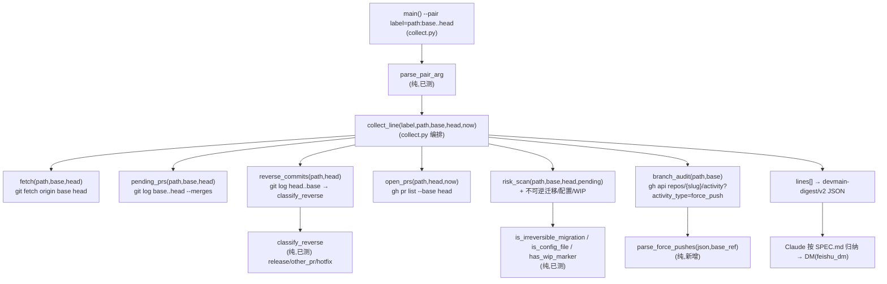

# devmain-brief 六维改造 · 编排层 Implementation Plan

> **For agentic workers:** REQUIRED SUB-SKILL: Use superpowers:subagent-driven-development (recommended) or superpowers:executing-plans to implement this plan task-by-task. Steps use checkbox (`- [ ]`) syntax for tracking.

**Goal:** 把 devmain 发布简报从"单仓固定 main..dev"升级成"可配置分支对 × 三条发布线 + SRE 六维告警"，并修复反向提交误报 CRITICAL。

**Architecture:** 纯函数层（六维检测 `is_irreversible_migration`/`is_config_file`/`has_wip_marker` + `parse_pair_arg` + `classify_reverse`）已就绪（commit 9b1703c，22 测试过）；`parse_force_pushes` 是本 plan Task 2 **新增**的纯函数（9b1703c 尚无）。本 plan 只改**编排层**——把硬编码的 `origin/main..origin/dev` 泛化成 `base..head` 参数，新增 `branch_audit`（GitHub activity API 查 force-push）接入六维告警，`collect_repo`→`collect_line`，`main` 从 `--repo` 改 `--pair`，输出 schema v1→v2（`repos[]`→`lines[]`），同步升级 SPEC.md。

**Tech Stack:** Python 3 标准库 only；`git` + `gh`（已登录）；pytest（现有 test_collect.py，22 passed）。

## Global Constraints

- **fail-fast 铁律**：git / fetch / gh / 新增 GitHub activity API 调用全部非零退出即抛错，禁止部分成功/降级/`fetch_ok` 标记。branch_audit API 失败 = 整仓失败。（来源：feedback_fail_fast_no_graceful_degradation）
- **只读**：脚本不改任何仓状态，全 subprocess list 形式（无 shell 注入）。
- **冒烟只用 guard-safe worktree**：nine=`~/nanoclaw-worktrees/nine-dev`、recruit-api=`~/nanoclaw-worktrees/nine-recruit-api-dev`，禁止 `~/Desktop/vibe-coding/`。recruit-agent 第三条线在 nine-dev 内跑（同仓）。
- **纯函数已冻结**：`is_irreversible_migration` / `is_config_file` / `has_wip_marker` / `parse_pair_arg` / `classify_reverse`（collect.py:92-140）已测试通过，本 plan 不改它们，只调用。
- **测试框架**：pytest，monkeypatch `collect.subprocess.run` 打桩 git/gh（沿用现有 test 模式）。
- **禁造词**：SPEC 文案中文为主、英文 slug 当索引、不许自造术语（"反向雷/缓发"）。
- **plan 验证 grep 写完立刻本地跑**（feedback_plan_self_check_grep_locally_first）。

```yaml
codex_effort: high
codex_effort_why: 接入新 GitHub activity API + 三线数据模型重构 + 修 CRITICAL 误报；重于纯内部逻辑，但只读脚本 5min 可 revert、无 DB migration / 无飞书真发，未到 xhigh。
```

---

## 数据流图



**物理链路**：`git/gh 本地命令 + GitHub REST activity API`（force-push 事件的唯一权威源，本地 reflog 不跨 clone）→ collect.py stdout JSON → nanoclaw agent 读 → 飞书 DM。force-push 检测**必须**走远端 API：本地 `origin/main` 只是最新指针，reflog 不含他人的强推历史。

## 写入路径矩阵（六维 × 数据源 × 输出字段）

| 维度 | 数据源 | 检测函数 | v2 输出字段 |
|---|---|---|---|
| ① 变更风险 | pending PR subjects | `has_wip_marker` | `risk.wip_prs[]` |
| ② 分支完整性 | rev-list 计数 + base 最后提交日期 | collect_line 内联 | `dev_ahead_base` / `base_ahead_dev` / `base_stale_days` |
| ③ 数据安全 | schema 文件内容(git show) | `is_irreversible_migration` | `risk.irreversible_migrations[]` |
| ④ 配置环境 | diff --name-only | `is_config_file` | `risk.config_changes[]` |
| ⑤ 可回滚 | 同③(不可逆迁移=不可回滚) | `is_irreversible_migration` | 复用 `risk.irreversible_migrations[]` |
| ⑥ 审计 | GitHub activity API | `parse_force_pushes` | `branch_audit.force_pushes[]` |
| (反向防误报) | head..base 提交 | `classify_reverse` | `reverse_commits.{release,other_pr,real_hotfixes}[]` |

**缺口检查**：⑤可回滚无独立数据源——不可逆迁移即"发坏退不回"，与③同源，SPEC 归纳时同一条同时标 ③/⑤（沿用已定稿设计）。force-push(⑥) 与 base 领先/久未更新(②) 共同支撑"疑似回滚"判断，但 collect 只出**客观信号**，"疑似回滚"结论由 SPEC 归纳层下（避免 collect 硬编阈值误判）。

## 分支对 → 三条发布线

| 发布线 label | worktree path | base | head | repo slug(force-push 审计用) |
|---|---|---|---|---|
| `nine` | `~/nanoclaw-worktrees/nine-dev` | `origin/main` | `origin/dev` | TierIITech/nine |
| `小招 Agent` | `~/nanoclaw-worktrees/nine-dev` | `origin/recruit-agent/prod` | `origin/recruit-agent/dev` | TierIITech/nine |
| `nine-recruit-api` | `~/nanoclaw-worktrees/nine-recruit-api-dev` | `origin/main` | `origin/dev` | TierIITech/nine-recruit-api |

- **base/head 带 `origin/` 前缀**由 `--pair` 传入的完整 refspec 决定；`fetch` 从 refspec 剥 `origin/` 得远端分支名（`recruit-agent/dev` 含斜杠，`git fetch origin recruit-agent/dev` 合法）。
- **repo slug 由 `repo_slug(path)` 动态取**（`gh repo view --json nameWithOwner`），不硬编码；小招线与 nine 线同 slug（同仓）。
- `head_branch`（给 classify_reverse）= head 剥 `origin/` 后的分支名：`dev` / `recruit-agent/dev`。

---

## Task 1: 分支对参数化 + reverse 三分类接入

**Files:** Modify `scripts/devmain-release-brief/collect.py` · Test `scripts/devmain-release-brief/test_collect.py`

**Interfaces produced:**
- `remote_branch(ref)` → str：剥 `origin/` 前缀（`origin/recruit-agent/dev`→`recruit-agent/dev`）
- `fetch(cwd, base, head)` · `head_sha(cwd, head)` · `pending_prs(cwd, base, head)` · `open_prs(cwd, head, now)` · `risk_scan(cwd, base, head, pending)`
- `reverse_commits(cwd, base, head, head_branch)` → `{release_merges[], other_pr_merges[], real_hotfixes[]}`（**只 real_hotfixes 带 files**）
- `collect_line(label, path, base, head, now)` → line dict

- [ ] **Step 1: 写失败测试 —— reverse 三分类（CRITICAL 修复核心）**

在 test_collect.py 追加（monkeypatch git log 输出，覆盖三类 + 小招线嵌套分支名）：
```python
def test_reverse_commits_three_way(monkeypatch):
    log_out = "\n".join([
        "h1\x01alice\x012026-07-01T00:00:00Z\x01Merge pull request #1 from TierIITech/dev",
        "h2\x01bob\x012026-07-02T00:00:00Z\x01Merge pull request #2 from TierIITech/feat/x",
        "h3\x01carol\x012026-07-03T00:00:00Z\x01fix: 直接 hotfix prod redis",
    ])
    calls = []
    def fake_sh(args, cwd):
        calls.append(args)
        if "--name-only" in args: return "svc/redis.py"
        return log_out
    monkeypatch.setattr(collect, "sh", fake_sh)
    r = collect.reverse_commits("/x", "origin/main", "origin/dev", "dev")
    assert len(r["release_merges"]) == 1
    assert len(r["other_pr_merges"]) == 1
    assert len(r["real_hotfixes"]) == 1          # 只有非 merge 直接提交
    assert r["real_hotfixes"][0]["files"] == ["svc/redis.py"]
    assert "files" not in r["release_merges"][0]  # 非 hotfix 不做昂贵 diff

def test_reverse_commits_recruit_agent_no_false_positive(monkeypatch):
    # 小招线:46 个功能 PR merge 反向,旧逻辑全误报;新逻辑归 other_pr,real_hotfixes=0
    log_out = "\n".join(
        "h%d\x01u\x012026-07-01T00:00:00Z\x01Merge pull request #%d from TierIITech/feat/x%d" % (i, i, i)
        for i in range(46))
    monkeypatch.setattr(collect, "sh", lambda a, c: log_out)
    r = collect.reverse_commits("/x", "origin/recruit-agent/prod", "origin/recruit-agent/dev", "recruit-agent/dev")
    assert len(r["real_hotfixes"]) == 0
    assert len(r["other_pr_merges"]) == 46

def test_remote_branch():
    assert collect.remote_branch("origin/dev") == "dev"
    assert collect.remote_branch("origin/recruit-agent/dev") == "recruit-agent/dev"
    assert collect.remote_branch("dev") == "dev"
```

**⚠️ 同步更新现有 fetch 测试（签名 `fetch(cwd)`→`fetch(cwd,base,head)`，否则 TypeError）** —— test_collect.py:87 / :95 两处 `collect.fetch("/tmp/whatever")` 改为：
```python
    collect.fetch("/tmp/whatever", "origin/main", "origin/dev")
```
（这是**更新**不是新增；改后 22 个现有测试仍全绿，故 Task 1 后总数 = 22 + 3 新 = 25。）

- [ ] **Step 2: 跑测试确认 RED** — `python3 -m pytest test_collect.py -k "reverse_commits or remote_branch" -v` → FAIL（`remote_branch` 未定义 / `reverse_commits` 签名不符）

- [ ] **Step 3: 实现** —— collect.py 改动：

`remote_branch` 新增（放纯解析层，紧邻 parse_pair_arg）：
```python
def remote_branch(ref):
    # "origin/recruit-agent/dev" → "recruit-agent/dev";无 origin/ 前缀原样返回
    return ref[len("origin/"):] if ref.startswith("origin/") else ref
```

`fetch` / `head_sha` 泛化：
```python
def fetch(cwd, base, head):
    rb, rh = remote_branch(base), remote_branch(head)
    r = subprocess.run(["git", "fetch", "origin", rb, rh, "--quiet"],
                       cwd=cwd, capture_output=True, text=True)
    if r.returncode != 0:
        raise FetchError("git fetch failed in %s: %s" % (cwd, (r.stderr or "").strip()))

def head_sha(cwd, head):
    return sh(["git", "rev-parse", "--short", head], cwd)
```

`pending_prs(cwd, base, head)`：把首行 `git log` 的 `origin/main..origin/dev` 换成 `"%s..%s" % (base, head)`；其余不变。

`open_prs(cwd, head, now)`：`--base` 参数值从字面 `"dev"` 换成 `remote_branch(head)`。

`risk_scan(cwd, base, head, pending)`：**risk_scan 内有三处** `origin/main..origin/dev`（collect.py:238 diff、:247 multi_author log、:263 Revert 直接提交扫描），**全部三处**换成统一变量——函数体首行加 `rng = "%s..%s" % (base, head)`，三处 range 实参改用 `rng`。⚠️ 漏改 :263（Revert 扫描）会让小招/recruit-api 线用错 main..dev 范围混入错误 revert（Codex round-3 MAJOR）。六维新增字段在 Task 3。

`reverse_commits` 重写（三分类，只 hotfix 带 files）：
```python
def reverse_commits(cwd, base, head, head_branch):
    out = sh(["git", "log", "%s..%s" % (head, base),
              "--format=%H%x01%an%x01%cI%x01%s"], cwd)
    release, other_pr, hotfix = [], [], []
    for line in filter(None, out.splitlines()):
        h, an, ci, s = line.split("\x01")
        rec = {"hash": h[:9], "author": an, "date": ci, "subject": s}
        cls = classify_reverse(s, head_branch)
        if cls == "release":
            release.append(rec)
        elif cls == "other_pr":
            other_pr.append(rec)
        else:
            rec["files"] = [f for f in sh(["git", "-c", "core.quotepath=false",
                            "diff", "--name-only", h + "^1", h], cwd).splitlines() if f]
            hotfix.append(rec)
    return {"release_merges": release, "other_pr_merges": other_pr, "real_hotfixes": hotfix}
```

`collect_repo` → `collect_line`（branch_audit 在 Task 2 接入，此处先占位不含）：
```python
def collect_line(label, path, base, head, now):
    fetch(path, base, head)
    pending = pending_prs(path, base, head)
    hb = remote_branch(head)
    return {"line": label, "base": base, "head": head, "head_sha": head_sha(path, head),
            "dev_ahead_base": int(sh(["git", "rev-list", "--count", "%s..%s" % (base, head)], path) or 0),
            "base_ahead_dev": int(sh(["git", "rev-list", "--count", "%s..%s" % (head, base)], path) or 0),
            "base_stale_days": compute_days_stale(
                sh(["git", "log", "-1", "--format=%cI", base], path), now),
            "pending_merged_prs": pending,
            "reverse_commits": reverse_commits(path, base, head, hb),
            "open_prs_targeting_dev": open_prs(path, head, now),
            "risk": risk_scan(path, base, head, pending)}
```

- [ ] **Step 4: 跑测试确认 GREEN** — `python3 -m pytest test_collect.py -v` → 全绿（22 旧 + 3 新 = 25）
- [ ] **Step 5: Commit** — `git add -A && git commit -m "feat(devmain-brief): 分支对参数化 + reverse 三分类接入(修误报)"`


## Task 2: branch_audit — force-push / 回滚审计

**Files:** Modify `scripts/devmain-release-brief/collect.py` · Test `test_collect.py`

**Interfaces produced:**
- `parse_force_pushes(json_text)` → `[{actor, before, after, timestamp}]`（纯，可测）
- `repo_slug(cwd)` → `"owner/repo"`（副作用：`gh repo view`）
- `branch_audit(cwd, base, now)` → `{"force_pushes": [{actor,before,after,timestamp,days_ago}]}`（副作用：`gh api activity`；`days_ago` 供 SPEC 过滤旧事件）

**API 契约（已本地实测 TierIITech/nine-recruit-api，2026-07-16）：**
`gh api --paginate "repos/{slug}/activity?ref=refs/heads/{branch}&activity_type=force_push&per_page=100"` → JSON 数组，每项含 `activity_type`/`actor.login`/`timestamp`/`before`/`after`。**`--paginate` 自动跟 Link header 翻完所有页，彻底消除滑窗漏报**（回应 HANDOFF「翻多页防滑窗」）；因服务端 `activity_type=force_push` 过滤后事件极稀（实测该仓史上仅 4 次），翻页成本可忽略。fail-fast：`gh api` 非零退出即 `GhError`。
> 注：`gh api --paginate` 对 JSON 数组响应会**拼接**各页数组为单一数组（gh 已知行为），`json.loads` 正常解析。

- [ ] **Step 1: 写失败测试 —— parse_force_pushes（纯）**
```python
def test_parse_force_pushes():
    j = json.dumps([
        {"activity_type": "force_push", "actor": {"login": "zyue0956-bit"},
         "timestamp": "2026-07-10T13:56:21Z", "before": "535985ca6xxx", "after": "316ccf556xxx"},
        {"activity_type": "push", "actor": {"login": "someone"},
         "timestamp": "2026-07-09T00:00:00Z", "before": "aaa", "after": "bbb"},
    ])
    r = collect.parse_force_pushes(j)
    assert len(r) == 1                      # 防御性:只留 force_push
    assert r[0]["actor"] == "zyue0956-bit"
    assert r[0]["before"] == "535985ca"     # short 8
    assert r[0]["after"] == "316ccf55"
    assert r[0]["timestamp"] == "2026-07-10T13:56:21Z"

def test_parse_force_pushes_empty():
    assert collect.parse_force_pushes("[]") == []
```

- [ ] **Step 2: 跑测试确认 RED** — `python3 -m pytest test_collect.py -k force_pushes -v` → FAIL（未定义）

- [ ] **Step 3: 实现**
```python
def parse_force_pushes(json_text):
    # gh activity API 已服务端过滤 activity_type=force_push;此处防御性再过滤。
    out = []
    for a in json.loads(json_text or "[]"):
        if a.get("activity_type") != "force_push":
            continue
        out.append({"actor": (a.get("actor") or {}).get("login", "?"),
                    "before": (a.get("before") or "")[:8],
                    "after": (a.get("after") or "")[:8],
                    "timestamp": a.get("timestamp", "")})
    return out

def repo_slug(cwd):
    return gh_json(["gh", "repo", "view", "--json", "nameWithOwner", "-q", ".nameWithOwner"], cwd)

def branch_audit(cwd, base, now):
    slug = repo_slug(cwd)
    ref = "refs/heads/" + remote_branch(base)
    j = gh_json(["gh", "api", "--paginate",
                 "repos/%s/activity?ref=%s&activity_type=force_push&per_page=100" % (slug, ref)], cwd)
    fps = parse_force_pushes(j)
    for fp in fps:
        fp["days_ago"] = compute_days_stale(fp["timestamp"], now) if fp["timestamp"] else None
    return {"force_pushes": fps}
```
> **days_ago（Codex round-3 MAJOR）**：force_pushes 全量返回，但每条附 `days_ago`（复用 `compute_days_stale`）。SPEC §二规定：**force-push 告警只报 `days_ago <= 14` 的**，更早的历史强推不进每日简报——否则老 force-push 每天重复刷屏。

- [ ] **Step 3b: 写 branch_audit fail-fast 测试（MINOR→触及 fail-fast Global Constraint，纳入修复）**
```python
def test_branch_audit_fail_fast(monkeypatch):
    def boom(args, cwd=None, capture_output=None, text=None):
        class R: returncode = 1; stdout = ""; stderr = "gh: not found"
        return R()
    monkeypatch.setattr(collect.subprocess, "run", boom)
    with pytest.raises(collect.GhError):
        collect.branch_audit("/x", "origin/main", datetime(2026, 7, 16, tzinfo=timezone.utc))
```

- [ ] **Step 4: 接入 collect_line** —— 在 Task 1 的 `collect_line` return dict 加一行：
```python
            "branch_audit": branch_audit(path, base, now),
```

- [ ] **Step 5: 跑测试确认 GREEN** — `python3 -m pytest test_collect.py -v` → 28 passed（25 + 3：parse_force_pushes / empty / fail_fast）
- [ ] **Step 6: Commit** — `git commit -am "feat(devmain-brief): branch_audit force-push 审计(GitHub activity API)"`


## Task 3: 六维风险扩展（不可逆迁移 / 配置变动 / WIP）

**Files:** Modify `risk_scan` in `collect.py` · Test `test_collect.py`

**Interfaces produced:** `risk_scan(cwd, base, head, pending)` 返回 dict 追加三键：`config_changes[]`（③④）、`irreversible_migrations[]`（③⑤）、`wip_prs[]`（①）。

- [ ] **Step 1: 写失败测试**（monkeypatch sh 按参数分派）
```python
def test_risk_scan_six_dim(monkeypatch):
    pending = [{"pr": "1", "subject": "feat", "subjects": ["WIP: 调试", "feat: 正常"],
                "insertions": 10, "deletions": 5, "merge_hash": "m1"}]
    def fake_sh(args, cwd):
        if "diff" in args and "--name-only" in args:
            return "db/migrations/001_drop.sql\ndeploy/docker-compose.prod.yml\nsrc/app.py"
        if "diff" in args and "db/migrations/001_drop.sql" in args:   # 单文件 diff
            return "+ALTER TABLE users DROP COLUMN nick;\n- 旧行"
        if "log" in args:   # multi_author 扫描
            return ""
        return ""
    monkeypatch.setattr(collect, "sh", fake_sh)
    r = collect.risk_scan("/x", "origin/main", "origin/dev", pending)
    assert r["config_changes"] == ["deploy/docker-compose.prod.yml"]
    assert r["irreversible_migrations"] == ["db/migrations/001_drop.sql"]
    assert len(r["wip_prs"]) == 1
    assert r["wip_prs"][0]["pr"] == "1"
    assert r["wip_prs"][0]["subjects"] == ["WIP: 调试"]
```

- [ ] **Step 2: 跑测试确认 RED** — `python3 -m pytest test_collect.py -k risk_scan_six_dim -v` → FAIL（KeyError: config_changes）

- [ ] **Step 3: 实现** —— 在 `risk_scan` 已算出 `files`（name-only diff）与 `schema` 之后、`return` 之前插入：
```python
    config = sorted({f for f in files if is_config_file(f)})
    irreversible = []
    for f in schema:
        # 用 git diff 扫**加行**(而非 git show 全文):diff 对 diff 内文件永不失败 → 无 try/except → fail-fast 完整。
        diff = sh(["git", "-c", "core.quotepath=false", "diff", rng, "--", f], cwd)
        added = "\n".join(ln[1:] for ln in diff.splitlines()
                          if ln.startswith("+") and not ln.startswith("+++"))
        if is_irreversible_migration(added):
            irreversible.append(f)
    wip = [{"pr": p["pr"], "subjects": [s for s in p["subjects"] if has_wip_marker([s])]}
           for p in pending if has_wip_marker(p["subjects"])]
```
> **fail-fast 修复（Codex round-3 CRITICAL）**：原 `git show head:file` + `except GitError: continue` 会吞掉读取失败、漏报不可逆迁移。改用 `git diff rng -- f`——文件必在 diff 内故永不失败，删掉 try/except，git 任何异常仍整体 fail-fast。`rng` 复用 MAJOR1 修复引入的 `rng = "%s..%s" % (base, head)`。扫加行（`+` 开头、排除 `+++` 头）比全文更准：只看本次**新增**的破坏性 DDL。
并把 `return` dict 扩为：
```python
    return {"schema_changes": schema, "big_prs": big,
            "multi_author_files": multi[:15], "reverted_prs": reverted,
            "config_changes": config, "irreversible_migrations": irreversible, "wip_prs": wip}
```
> 注：`is_irreversible_migration` 对 `git show head:file` 的**全文**扫描；`irreversible` 的 `try/except GitError` 是唯一允许的"跳过单文件"——文件取不到是客观信号缺失，非任务失败（不违反 fail-fast：fetch/gh 仍整体 fail-fast，这里只是单个 schema 文件内容不可得时不误报）。

- [ ] **Step 4: 跑测试确认 GREEN** — `python3 -m pytest test_collect.py -v` → 29 passed（28 + 1）
- [ ] **Step 5: Commit** — `git commit -am "feat(devmain-brief): risk_scan 六维扩展(不可逆迁移/配置/WIP)"`


## Task 4: main --pair 改造 + 输出 v2 + SPEC 升级

**Files:** Modify `collect.py` `main()` · `SPEC.md` · Test `test_collect.py`

- [ ] **Step 1: 写失败测试 —— main 组装 lines[]（v2）**

**先在 test_collect.py 头部补 import**（现有仅 `datetime/pytest/collect`，本测试用到 `sys`/`json`，否则 NameError —— Codex round-3 MINOR）：
```python
import sys, json
```
```python
def test_main_pair_assembles_lines(monkeypatch, capsys):
    monkeypatch.setattr(collect, "collect_line",
        lambda label, path, base, head, now: {"line": label, "base": base, "head": head})
    monkeypatch.setattr(sys, "argv", ["collect.py",
        "--pair", "nine=/p:origin/main..origin/dev",
        "--pair", "小招=/p:origin/recruit-agent/prod..origin/recruit-agent/dev"])
    collect.main()
    doc = json.loads(capsys.readouterr().out)
    assert doc["schema"] == "devmain-digest/v2"
    assert len(doc["lines"]) == 2
    assert doc["lines"][0]["line"] == "nine"
    assert doc["lines"][1]["base"] == "origin/recruit-agent/prod"
```

- [ ] **Step 2: 跑测试确认 RED** — `python3 -m pytest test_collect.py -k main_pair -v` → FAIL（`--repo` required / schema v1）

- [ ] **Step 3: 实现 main()**
```python
def main():
    ap = argparse.ArgumentParser()
    ap.add_argument("--pair", action="append", required=True,
                    help="label=path:base..head,可多次(一条发布线一个)")
    ap.add_argument("--out", default="-")
    a = ap.parse_args()
    now = datetime.now(timezone.utc)
    lines = [collect_line(*parse_pair_arg(spec), now) for spec in a.pair]
    doc = {"schema": "devmain-digest/v2", "generated_at": now.isoformat(), "lines": lines}
    txt = json.dumps(doc, ensure_ascii=False, indent=2)
    if a.out == "-":
        print(txt)
    else:
        with open(a.out, "w", encoding="utf-8") as f:
            f.write(txt)
        print("written: " + a.out, file=sys.stderr)
```
并更新文件头 docstring 用法行为 `--pair label=path:base..head`。

- [ ] **Step 4: 跑测试确认 GREEN** — `python3 -m pytest test_collect.py -v` → 30 passed

并同步 collect.py 头部 docstring 用法行 + `main()` 内 `--repo` 相关注释 → 全部改为 `--pair`（MINOR：残留 `--repo` 描述会误导）。

- [ ] **Step 5: SPEC.md 升级 v1→v2**（内容源 = 本 worktree 已committed 的 `HANDOFF.md`「呈现设计」段，照搬其五段结构 + 六维图例）：
  - §一 数据契约：`devmain-digest/v1` `repos[]` → `v2` `lines[]`；字段表加 `line/base/head/base_stale_days/base_ahead_dev`、`branch_audit.force_pushes[]`、`reverse_commits.{release_merges,other_pr_merges,real_hotfixes}`（强调 **real_hotfixes 只含非 merge 直接提交**）、`risk.{config_changes,irreversible_migrations,wip_prs}`。
  - §二 归纳指令：改为**三条发布线各一块**，块内固定五段（结论→⚠️异常告警[六维标签]→⚠️发布风险[逐条归人]→📦大改动按主线→⏳待合入PR），标题 `📋 今日生产发布建议 · M-D` + 六维图例行 + 末尾六维体检小结。保留"禁造词/说人话/中文为主"。
  - **§二 必须写明确定性告警阈值（Codex round-3 MAJOR：无阈值则每日严重度漂移）**——异常告警按下列固定规则判，不靠 LLM 自由裁量：
    - 🔴 **疑似回滚**：`branch_audit.force_pushes` 中存在 `days_ago <= 14` 的 force-push（旧的不报）。
    - 📉 **发布积压**：`dev_ahead_base > 100`（提交数超阈值）。
    - 📉 **base 久未更新**：`base_stale_days > 14`。
    - ⚠️ **未回流 hotfix**：`reverse_commits.real_hotfixes` 非空（这才是"发前必须对齐"的真信号；`release_merges`/`other_pr_merges` 只做计数不告警）。
    - 全部不触发 → 一行绿字"分支健康"。
  - §三 已知局限：加"force_pushes per_page=100 上限（force-push 事件极稀，实际无漏）"、"irreversible 仅扫 schema 文件全文（非 schema 文件里的裸 SQL 不查）"。

- [ ] **Step 6: Commit** — `git commit -am "feat(devmain-brief): main --pair + digest v2 + SPEC 三线六维"`

- [ ] **Step 7:（上线备注，属 Phase 8 不在本 plan 执行）** merge feat→main 后，更新 `store/messages.db` scheduled_tasks(id=devmain-release-brief) 的 prompt，命令从 `--repo` 换成三条 `--pair`：
```
--pair nine=~/nanoclaw-worktrees/nine-dev:origin/main..origin/dev
--pair 小招Agent=~/nanoclaw-worktrees/nine-dev:origin/recruit-agent/prod..origin/recruit-agent/dev
--pair nine-recruit-api=~/nanoclaw-worktrees/nine-recruit-api-dev:origin/main..origin/dev
```


## Self-Review

**1. Spec 覆盖**（对照定稿设计）：
- 三条发布线 → Task 1（`--pair`/collect_line）+ Task 4（main）✓
- 六维：① WIP=Task3 · ② base 领先/久未更新=Task1(collect_line) · ③④ config=Task3 · ③⑤ 不可逆迁移=Task3 · ⑥ force-push=Task2 ✓
- reverse 三分类防误报 → Task 1 ✓
- SPEC 三线六维升级 → Task 4 ✓

**2. Placeholder 扫描**：无 TBD/TODO；每个代码步含完整代码 ✓

**3. 类型一致性**（跨任务签名核对）：
- `collect_line(label,path,base,head,now)` — Task1 定义、Task2 加 branch_audit 行、Task4 main 调用，一致 ✓
- `reverse_commits(cwd,base,head,head_branch)` — Task1 定义、collect_line 传 `(path,base,head,hb)` ✓
- `risk_scan(cwd,base,head,pending)` — Task1 改签名、Task3 扩返回、collect_line 传 `(path,base,head,pending)` ✓
- `branch_audit(cwd,base)` / `repo_slug(cwd)` / `parse_force_pushes(json_text)` / `remote_branch(ref)` — Task2/Task1 定义，调用点一致 ✓
- 输出字段 `reverse_commits.{release_merges,other_pr_merges,real_hotfixes}` — Task1 与 Task4 SPEC 描述一致 ✓

**4. 本地实证**（2026-07-16 已跑，见 plan 编写记录）：
- classify_reverse 三分类 + 小招嵌套分支名 → 实测输出与 Task1 测试断言字面一致 ✓
- parse_pair_arg 小招 refspec → 四元组正确 ✓
- 基线 `pytest` = 22 passed；Task1 **更新** 2 个 fetch 测试（非新增）+ 新增 3 → 25；Task2 +3（parse_force_pushes/empty/fail_fast）→ 28；Task3 +1 → 29；Task4 +1 → 30。算术自洽 ✓
- branch_audit API（`activity?activity_type=force_push`）实测返 #707 force-push，字段 actor/timestamp/before/after 对得上；`--paginate` 实测拼接多页为单数组 ✓

**测试基线锚点**：22 passed（commit 7cd29c4）。每 Task 后总数应为 25→28→29→30。
**Round-1 Claude critic 修复**：CRITICAL(fetch 测试签名+计数) + MAJOR(force-push 改 --paginate) + MINOR×2(branch_audit fail-fast 测试 / docstring --repo→--pair)。
**Round-3 Codex 修复**：CRITICAL(不可逆迁移弃 git show+try/except 改 git diff 扫加行,fail-fast 完整) + MAJOR×3(risk_scan 三处 range 用 rng 统一 / force-push 加 days_ago + SPEC 14 天窗 / SPEC 补确定性阈值 疑似回滚·积压·久未更新·未回流hotfix) + MINOR×2(test 补 import sys,json / plan:7 措辞纠正 parse_force_pushes 属 Task2 新增)。均已并入并本地实证(diff 扫加行 DROP→True/ADD→False)。

